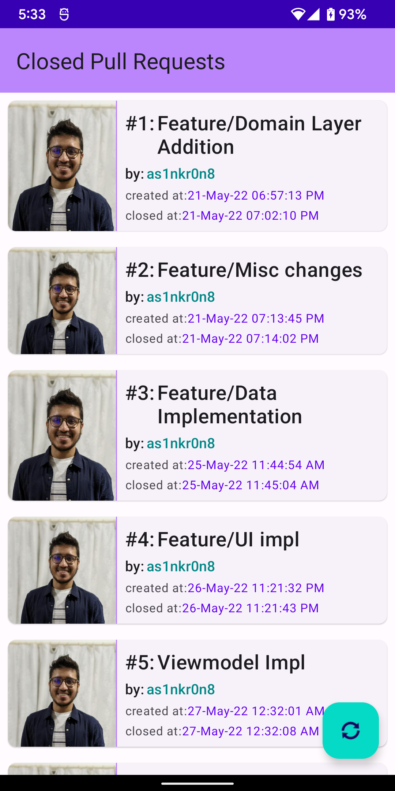

# Pull-Request-Viewer

A simple app to view pull requests(currently closed ones) from a Github repo, using Github APIs.

Code also uses CLEAN structure, along with tests for required classes.

The cards are drawn in RecyclerView.

Clicking on the card will expand with showing the pull request description.

There's a refresh button(FAB), to clear the view and fetch the closed pull requests from network again.

Screensnip (example)

